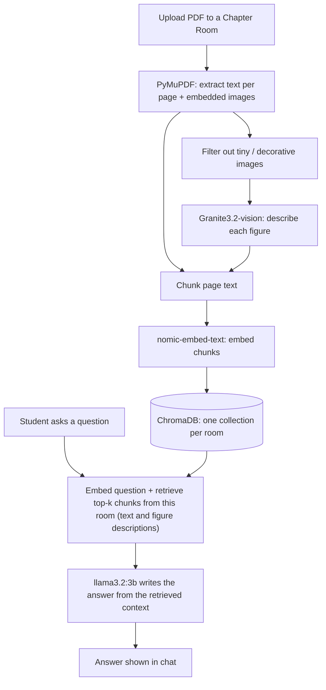

# SyllabiIQ

**An offline, chapter-focused study assistant that can read both the text and the diagrams in your PDFs.**

Create a room for a chapter, upload your PDFs, and chat with an AI that answers only from that chapter. Everything runs locally on your machine through [Ollama](https://ollama.com), so there are no API keys, no cloud uploads and no internet needed after setup.


<!-- Replace with your own screenshots or a demo GIF -->
<!--  -->

---

## Why this project

Students preparing for board exams or competitive tests juggle NCERT chapters, reference books and coaching notes. General AI chatbots help, but they need internet, send your material to the cloud, and mix up topics because they don't know which chapter you're on.

SyllabiIQ keeps each chapter in its own isolated room, so answers come from the material you uploaded and nothing else. It also reads the figures in your PDFs, which most text-only tools skip.

## Features

- **Chapter rooms.** One room per chapter, each with its own uploaded PDFs and its own vector collection, so the AI can't pull in content from other chapters.
- **Chat over your PDFs (RAG).** Ask questions, request summaries, or ask for practice questions. Answers are generated only from retrieved passages of the room's material.
- **Diagram and graph awareness.** Figures are described by a vision model at upload time, and those descriptions are indexed alongside the text. When you ask a question, relevant descriptions are retrieved and used to answer, so the AI can draw on diagrams and graphs too.
- **Fully offline.** All models run locally via Ollama.
- **Persistent storage.** Rooms, PDFs and extracted content are saved in SQLite and survive restarts.

> **Tip:** Summaries, flashcard-style Q&A and practice questions are not separate features. Just ask for them in chat, for example *"Summarize this chapter in 10 bullet points"* or *"Give me 5 MCQs on Newton's laws"*.

## How it works



### 1. Ingestion (on upload)

1. The PDF is saved under a room-specific folder and logged in SQLite.
2. **PyMuPDF** extracts the text of every page and every embedded image, keeping each image's page number.
3. Very small images (icons, logos, decorations) are filtered out by size.
4. Each remaining figure is sent to **Granite3.2-vision** with a general description prompt. The prompt is the same for every image and does not depend on any later question.
5. The text is split into paragraph-level chunks, and the figure descriptions are indexed alongside them.
6. Chunks are embedded with **nomic-embed-text** and stored in a **ChromaDB collection scoped to that room only**.

### 2. Question answering (in chat)

1. The question is embedded and the top-5 most similar chunks are retrieved from the current room's collection. These can be text chunks, saved figure descriptions, or both.
2. **llama3.2:3b** receives the question and the retrieved context, and writes the final answer in plain language.

The vision model only runs at upload time. At question time, the figure itself is not looked at again: the language model answers from the stored description.

### Why describe-then-reason?

Small vision models are good at reading labels and axes but weak at multi-step reasoning. SyllabiIQ lets the vision model look once and write down what it sees, and lets the text model do the reasoning over that description. This keeps chat fast, because no image is processed while you are asking questions.

The trade-off is that a description written at upload time is general. A very specific question about a figure (for example, "why does the curve flatten after 5 seconds?") can only be answered as well as the stored description allows.

## Tech stack

| Layer | Technology |
|---|---|
| Backend | Python, Flask, Uvicorn |
| Frontend | HTML, CSS, JavaScript |
| Database | SQLite |
| PDF processing | PyMuPDF |
| Vector store | ChromaDB |
| Embeddings | `nomic-embed-text` (via Ollama) |
| Vision model | `granite3.2-vision` (via Ollama) |
| Language model | `llama3.2:3b` (via Ollama) |

## Project structure

```
syllabiiq/
├── main.py              # Entry point: creates the app, mounts routers and static files
├── database.py          # SQLite setup and helper functions
├── requirements.txt     # libraries needed to be install
├── extractor.py         # PyMuPDF: text and image extraction
├── vision.py            # Granite3.2-vision: describe figures at upload
├── rag.py               # Chunking, embeddings, ChromaDB, retrieval, llama3.2 calls
│
│ 
│
├── templates/
│     ├── HTML files
├── 
├── uploads/             # Uploaded PDFs, one folder per room (auto-created when user creates a room)
└── chroma_db/           # Vector data (auto-created)
```

**SQLite tables:** `rooms`, `resources`, `uploaded_pdfs`, `page_content`, `page_images`. Every table carries a `room_id`.

## Getting started

### Prerequisites

- Python 3.10 or newer
- [Ollama](https://ollama.com/download) installed and running
- About 5 GB of free disk space for the models
- 8 GB RAM is the practical minimum, 16 GB is more comfortable. A GPU helps but is not required, though CPU-only inference will be slower. The app was tested on GPU only

### Installation

```bash
# 1. Clone the repository
git clone https://github.com/AdvaySingh-9/syllabiiq.git
cd syllabiiq

# 2. Create and activate a virtual environment
python -m venv venv
source venv/bin/activate        # Windows: venv\Scripts\activate

# 3. Install dependencies
pip install -r requirements.txt

# 4. Pull the models (one time, needs internet)
ollama pull llama3.2:3b
ollama pull granite3.2-vision
ollama pull nomic-embed-text
```

### Run

```bash
Press F5 or click on run button.
```

Open **http://127.0.0.1:7860** in your browser.

### Usage

1. Click **Start a new chapter** and give the room a name (e.g. "Motion").
2. Upload one or more PDFs for that chapter and wait for processing to finish. Pages with many figures take longer. It entirely depends on the computer's specs.
3. Open the chat and ask anything about the chapter.

Example prompts:

- *"Explain the difference between speed and velocity."*
- *"What does the velocity-time graph in this chapter show?"*
- *"Summarize this chapter in 10 bullet points."*
- *"Give me 5 MCQs with answers on uniform acceleration."*

## Limitations

- **Text-based PDFs only.** Scanned or photographed pages have no extractable text, and OCR is not supported yet.
- **Small local models.** `llama3.2:3b` and `granite3.2-vision` can misread complex graphs, dense tables or handwritten content. Always check important answers against your book.
- **Figures are described once, at upload.** The vision model never sees your question, so answers about a figure rely on a general description. Detailed or unusual questions about a diagram may get vague or incomplete answers.
- **One chapter at a time.** Whole-chapter summaries only work if the relevant text fits in the model's context window, so keep each room to a single chapter rather than a full book.
- **Speed depends on your hardware.** Ingestion (vision step) and answers are slower on CPU-only machines.
- **No authentication.** This is a single-user local app.

## Future Roadmap

I have planned some useful features for the upcoming updates, including:-

- Question-aware image reasoning: re-run the relevant figure through the vision model together with the student's question at chat time
- Dedicated flashcard, quiz and chapter-test generators
- Per-topic weakness detection and mastery score
- Syllabus progress tracker
- AI-generated revision PDFs (WeasyPrint)
- OCR for scanned PDFs
- Mind maps, formula sheets and audio explanations

## Contributing

Issues and pull requests are welcome. If you plan a large change, please open an issue first to discuss it.

## License

Released under the [MIT License](LICENSE).

## Acknowledgements

- [Ollama](https://ollama.com) for easy local model serving
- [ChromaDB](https://www.trychroma.com), [PyMuPDF](https://pymupdf.readthedocs.io) and [Flask](https://flask.palletsprojects.com/en/stable/)
- Meta (Llama 3.2), IBM (Granite Vision) and Nomic AI (nomic-embed-text) for the open models
